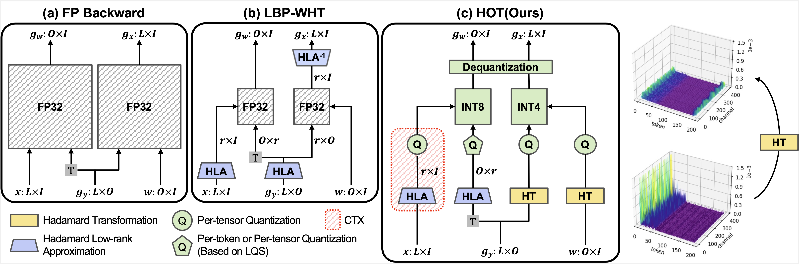

# \[CVPR 2025\] HOT: Hadamard-based Optimized Training
This repositorty is official code of HOT: Hadamard-based Optimized Training. HOT achieves up to 75% memory savings and a 2.6X acceleration on real GPUs, with negligible accuracy loss compared to FP32 precision.

[](https://arxiv.org/abs/arXiv-2503.21261)



## Overview
It has become increasingly important to optimize backpropagation to reduce memory usage and computational overhead. Achieving this goal is highly challenging, as multiple objectives must be considered jointly while maintaining training quality. In this paper, we focus on matrix multiplication, which accounts for the largest portion of training costs, and analyze its backpropagation in detail to identify lightweight techniques that offer the best benefits. Based on this analysis, we introduce a novel method, Hadamard-based Optimized Training (HOT). In this approach, we apply Hadamard-based optimizations, such as Hadamard quantization and Hadamard low-rank approximation, selectively and with awareness of the suitability of each optimization for different backward paths. Additionally, we introduce two enhancements: activation buffer compression and layer-wise quantizer selection. Our extensive analysis shows that HOT achieves up to 75% memory savings and a 2.6X acceleration on real GPUs, with negligible accuracy loss compared to FP32 precision.

## Demo code
You can reproduce the accuracy, memory reduction, computation cost result of HOT during finetuning ViT-B with CIFAR100.

```
HOT/
├── main.sh    
├── memory_analysis.sh
├── gbops_analysis.sh
└── cuda_measure/
    └── measure.py
```

Current code requires:
- pytorch >= 2.1.0
- CUDA >= 11.8
- Ampere architecture GPU (RTX 3090, etc..)

1. Install the all dependencies.
    ```
    pip install -r requirements.txt
    ```
2. Train the ViT-B with cifar100. 
    
    Note that training code is conducted on fake quant, not real quant. This code is only for validate the accuracy of HOT pipeline, thus memory reduction and acceleration is not optimized. 
    ```
    bash main.sh
    ```
3. Calculate the memory consumption during training ViT-B with Imagenet100.
    ```
    bash memory_analysis.sh
    ```
4. Calculate the computing cost of ViT-B during training ViT-B with Imagenet100.
    ```
    bash gbops_analysis.sh
    ```

5. latency comparison: 
    1. Install [CUTLASS](https://github.com/NVIDIA/cutlass) in HOT directory.
        ```
        git clone https://github.com/NVIDIA/cutlass.git
        mkdir build && cd build
        export CUDACXX=/usr/local/cuda/bin/nvcc
        cmake .. -DCUTLASS_NVCC_ARCHS=86         # RTX 3090
        ```
    2. Install the HLQ_backward kernel.
        ```
        python setup_HLQ.py install
        ```
    3. Conduct the measurement of backward latency per layer.
        ```
        python measure.py
        ```


### Cite
If you find our code or HOT useful for your research, please consider citing:

```
@misc{kim2025hothadamardbasedoptimizedtraining,
      title={HOT: Hadamard-based Optimized Training}, 
      author={Seonggon Kim and Juncheol Shin and Seung-taek Woo and Eunhyeok Park},
      year={2025},
      eprint={2503.21261},
      archivePrefix={arXiv},
      primaryClass={cs.LG},
      url={https://arxiv.org/abs/2503.21261}, 
}
```
